# Planner App  
**A Task Management System with Planner, Kanban, and Journal Features. Visit site [here](https://planner-frontend.favours-planner.xyz/)**
## **Table of Contents**
1. [Overview](#overview)
2. [Key Features](#2-key-features)
   - Task Hierarchy 
   - Planner 
   - Kanban 
   - Journal
3. [Local App Setup](#3-local-setup)
4. [Technical Details](#4-technical-details)
   - Tech Stack
   - Data Model
   - Data/info Flow
   - Deployment Flow
   - API Documentation
5. [App Visuals](#5-app-visuals)

# 1. Overview 
This web app is a **task management system** that allows users to:
- Organize work into **Projects**, **Objectives**, and **Tasks** (hierarchically: Tasks → Objectives → Projects).
- Schedule tasks and audit previous tasks in **Planner Page**.
- Track task progress using a **Kanban board** (To Do, In Progress, Paused, Completed).
- Automatically log task start and completion times in the **Homepage** (journal).<br/>
For planner app tutorial video see:<br/>
[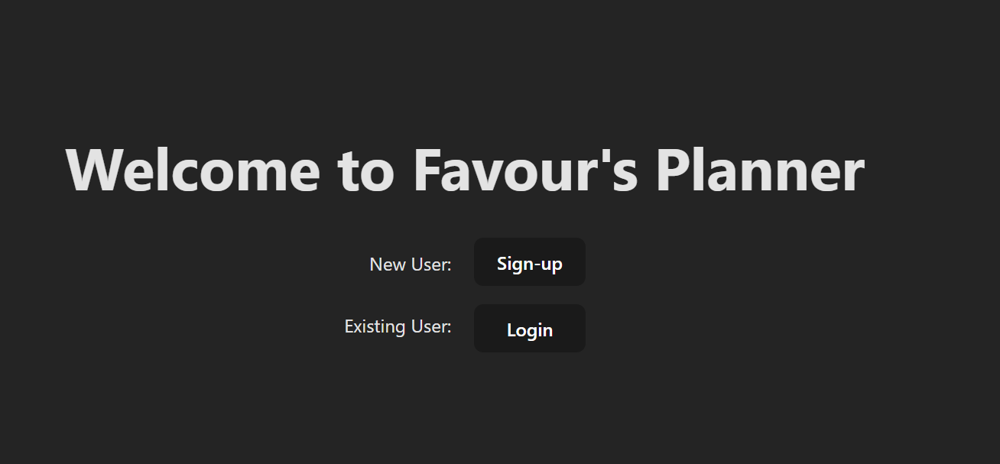](https://www.youtube.com/watch?v=DPIR3Oeixjo)

# 2. Key Features
### **1. Task Hierarchy**
- **User**>**Project**>**Objective**>**Task** structure: 
### **2. [Planner]((#planner-page)) (Calendar View)**
- Create unscheduled tasks.
- Drag-and-drop unscheduled tasks into the calendar to schedule them.
- Visualise workload distribution.
### **3. [Kanban Board](#kanban-page)**
- **Status Columns**: To Do, In Progress, Paused, Completed.
- **Drag-and-drop** to update task status.
- **Automatic 2nd order field updates on Drag and Drop**:
    - E.g. `start` field is updated when dragging task from **To Do → In Progress**.
    - Other status changes trigger relevant updates.
### **4. [Journal](#homepage-journal) (Activity Log)**
- As user moves tasks in Kanban from To Do ->In Progress -> Completed, the homepage automatically records task start/finish times.
- Provides an audit trail of task progress.
# 3. Local Setup
## **Prerequisites**
- Node.js (for React)
- Python 3.12.x (for Flask)
- Create the following .env files
    ```
    # .env
    backend_host_port=5000
    VITE_APP_ENV=dev
    local_host_backend_base_url=http://127.0.0.1:

    # b/.env (not actual flask secret and encryption keys)
    flaskAppSecretKey='e868207f-3376-46cb-923f-e1b885b0a276'
    sessionEncryptionKey='qdokKcFMxoQBBkSXq6rxavCsxtLrzlOZIwAguWoMrZ0='

    accessTokenDurationMins=
    refreshTokenDurationDays=

    mySQLHost=
    mySQLPassword=
    mySQLPort=
    mySQLUser=

    username_limit=15
    email_limit=120
    project_title_limit=80
    objective_title_limit=80
    task_description_limit=200

    #f/.env.development
    VITE_APP_ENV=dev
    VITE_BACKEND_API_URL=http://127.0.0.1:5000/api
    ```
- Optional: MySQL Workbench 8.0.43 (to test app with mysql backend)
note: choosing the mysql backend means setting up a mysql db for the app and filling in the myql credentials env vars in  the b/.env file. 

## Local App Setup Steps
1) Create the environment variables in the prequisite (mysql vars are optional)
2) Create python venv, activate it and install backend dependencies
    ```bash 
    #go to backend dir  
    cd b/
    
    #create python env
    python -m venv .venv
    
    #activate the created env
    source .venv/Scripts/Activate
    
    #install the backend dependencies
    pip install -r requirements.txt
    ```
3) Install frontend dependencies. 
    ```bash
    #go to frontend dir  
    cd f/
    # install frontend dependencies
    npm i
    ``` 
4) Optional: Create Database in MySQL workbench called "planner_app_db" (if using mysql db)
5) Run development env for backend flask app and frontend
	 - If user has PowerShell 
		```powershell
        # sqlite db
		./runApp.ps1 -env dev -rdbms sqlite

        # mysql db
        ./runApp.ps1 -env dev
		```
		This creates opens a PowerShell window with split terminals: 1 for the flask app and one for the react app.


	- if user has bash terminal. Open 2 terminals<br/>
		terminal 1 - flask app
		```bash
		cd b

        #sqlite db
        python main.py --env dev --rdbms sqlite

        # mysql db
		python main.py --env dev --rdbms mysql
		```
		terminal 2 - react app
		```bash
		cd f
		npm run dev
		```

# 4. Technical Details
## Tech Stack
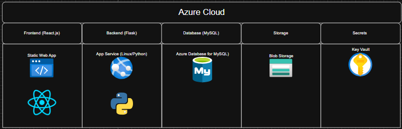
- Python (3.12): for dependencies see b/requirements.txt
- React (19.0.8): for dependencies see f/package.json
- Azure Static Web App (Free Tier)
- Azure App Service (Tier: F1, RAM: 1GB, Storage: 1GB)
- Azure Database for MySQL flexible server: Burstable, B1ms, 1 vCores, 2 GiB RAM, 20 GiB storage, 360 IOPS
## Data Model 
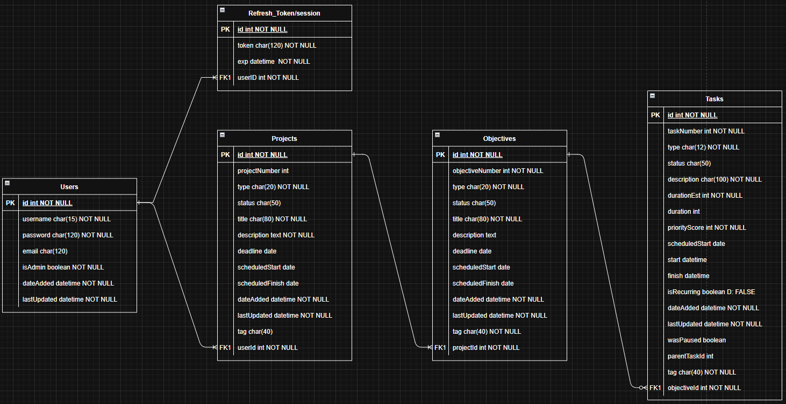

## Data/Info Flow
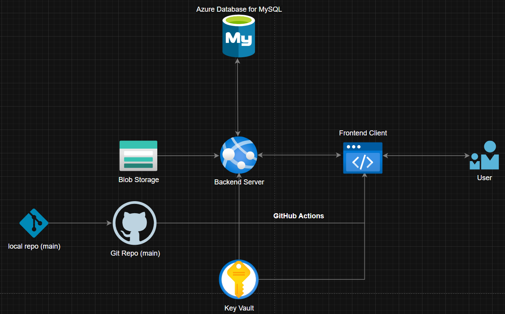

## Deployment Flow
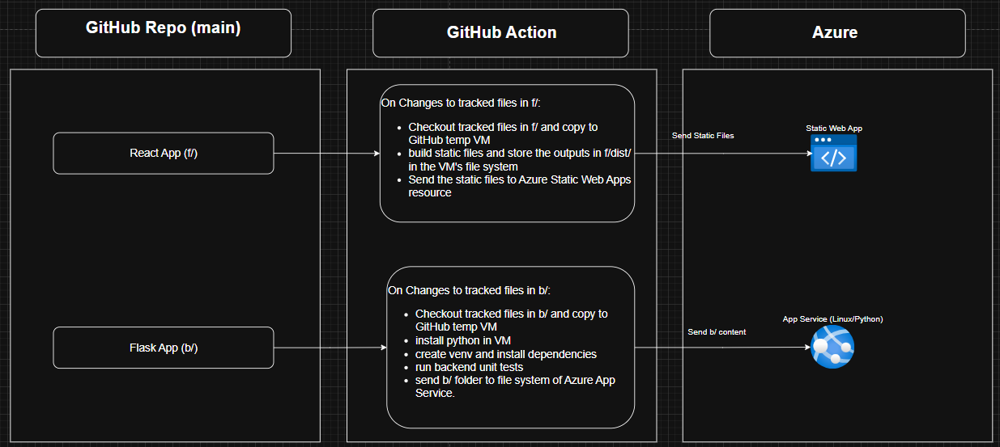
## API Docs
Swagger UI API docs can be found [here](https://plannerappbackendnc-dad9ghcgd6ame2cc.ukwest-01.azurewebsites.net/api/docs): 
# 5. App Visuals
## Guest Page
Purpose: Facilitate User signup and login. 
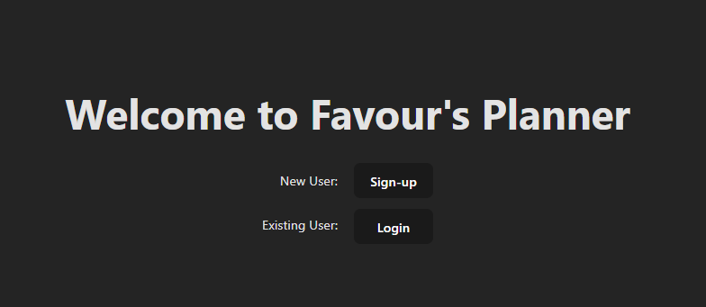
## Homepage (Journal)
Purpose: Logs in real time when the user starts/completes tasks.<br/>
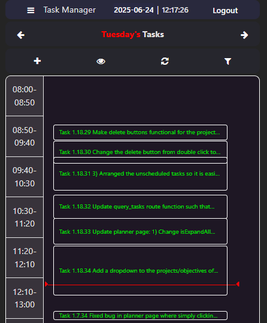

## Entity Page (Tasks)
Purpose: Lists all the user's projects, objectives or tasks<br/>
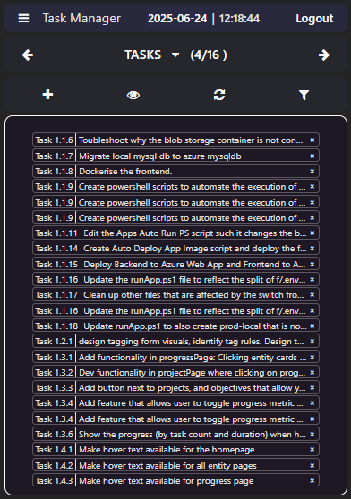
## Entity Form (Task)
Purpose: Allows users to create a new entity (projects, objectives or tasks); or edit the fields of an existing entity. 
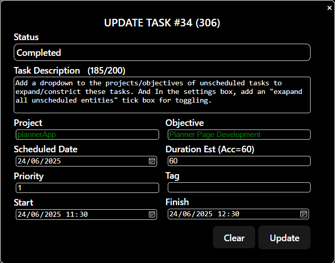
## Kanban Page
Purpose: Drag and drop interface allows users to quickly edit the status of a task (To Do, In Progress, Paused and Completed) as well as the second order effects of changing status* without having to manually edit the task form. 
\*e.g. when a task moves from "To Do" --> "In Progress" log the start time)  
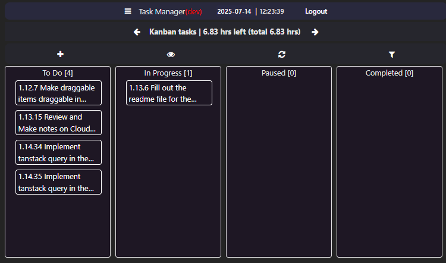
## Progress Page
Purpose: View the progress of projects and objectives based on task duration or task count. 
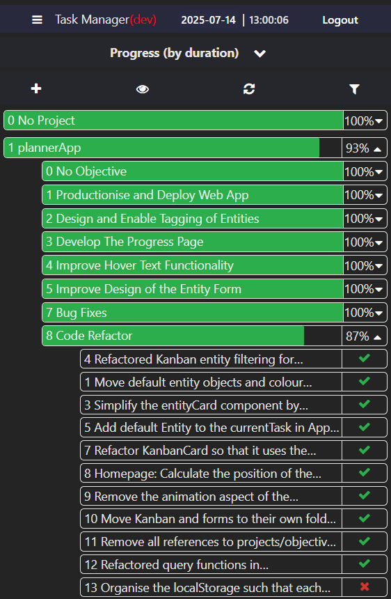

## Planner Page
Purpose: To quickly create and schedule tasks via drag and drop interface. 
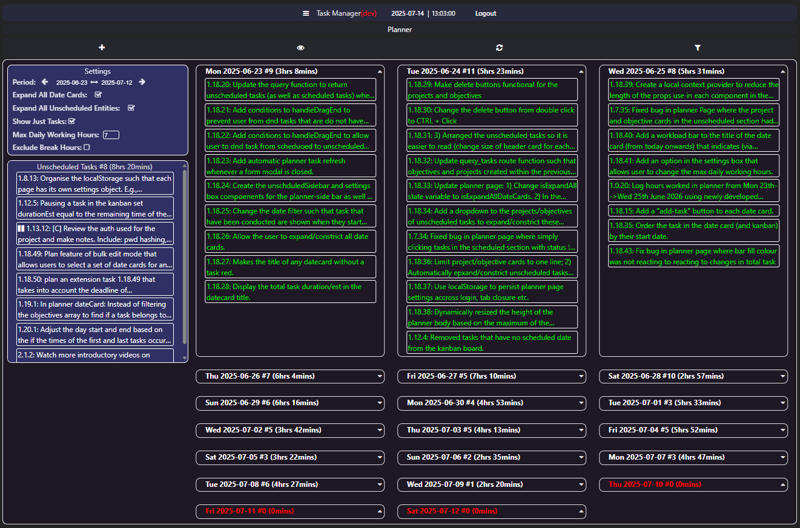

